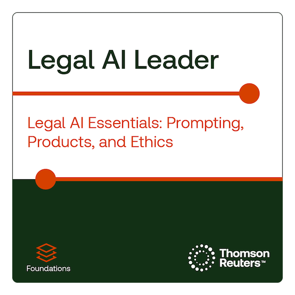
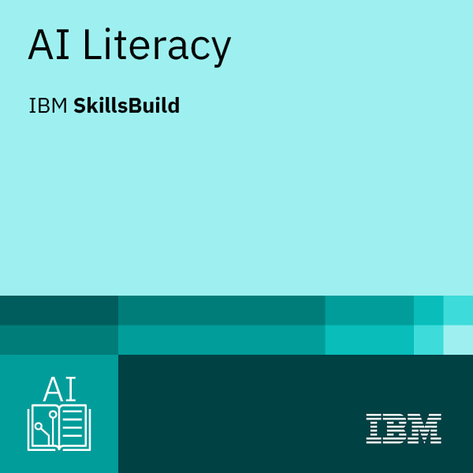
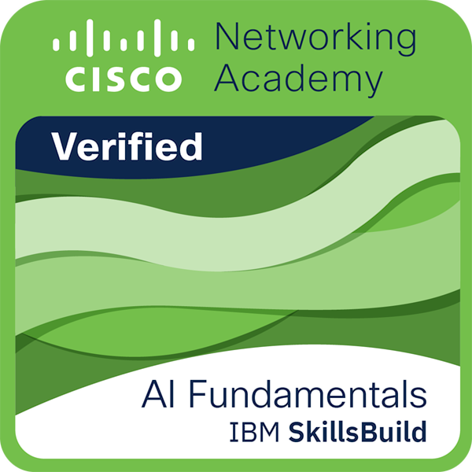
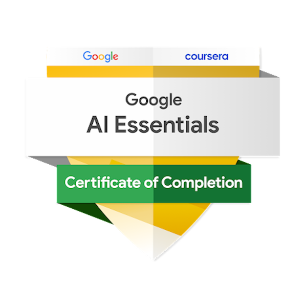

# 🇪🇺 EU AI Act Toolkit

<p align="center">
  
</p>

Practical templates, checklists, and documentation tools for SMEs working toward EU AI Act readiness.

- 🧩 Organise your AI inventory
- 🛡️ Screen higher-risk or unclear use cases
- 📄 Build baseline governance and documentation support

Designed as a practical starting point for readiness, screening, and internal documentation - not as a substitute for qualified legal or technical review.

> ⚠️ This toolkit is educational and informational only. It is not legal advice and does not provide compliance assurance.

## 👤 Maintainer

**[Artem Nazarko](https://github.com/artemhobotun)** is a legal professional, researcher, and legal-tech builder focused on AI governance, AI literacy, compliance readiness, and practical legal documentation for businesses and global teams. His experience includes work with the Ukrainian Bar Association and research roles connected with the University of Bergen, the University of Vienna, Palacký University Olomouc, and London South Bank University.

He is also the maintainer of the EU AI Act Toolkit, a GitHub-based project focused on making AI governance and EU AI Act readiness more practical, accessible, and easier to navigate.

<p>
  <a href="https://github.com/artemhobotun"></a>
  <a href="https://www.linkedin.com/in/artem-nazarko/"></a>
  <a href="https://www.credly.com/users/artem-nazarko"></a>
  <a href="https://orcid.org/0000-0002-4190-7288"></a>
</p>

## 🎓 Selected Credentials

Selected public credentials and professional badges are available through Credly.

<table width="100%">
  <tr>
    <td align="center" width="16.66%">
      <a href="https://www.credly.com/badges/58cabc99-a446-46aa-9c0e-346a52071f2e/public_url">
        
      </a>
      <br>
      <sub><nobr>Microsoft&nbsp;Elevate</nobr></sub>
      <br>
      <a href="https://www.credly.com/badges/58cabc99-a446-46aa-9c0e-346a52071f2e/public_url"><sub><nobr>Verify&nbsp;on&nbsp;Credly</nobr></sub></a>
    </td>
    <td align="center" width="16.66%">
      <a href="https://www.credly.com/badges/193a3f60-2ffd-4e76-a04e-5191cba610aa/public_url">
        
      </a>
      <br>
      <sub><nobr>Google&nbsp;/&nbsp;Coursera</nobr></sub>
      <br>
      <a href="https://www.credly.com/badges/193a3f60-2ffd-4e76-a04e-5191cba610aa/public_url"><sub><nobr>Verify&nbsp;on&nbsp;Credly</nobr></sub></a>
    </td>
    <td align="center" width="16.66%">
      <a href="https://www.credly.com/badges/f857b433-a33e-43be-8cfc-5f137335b704/public_url">
        
      </a>
      <br>
      <sub><nobr>Thomson&nbsp;Reuters</nobr></sub>
      <br>
      <a href="https://www.credly.com/badges/f857b433-a33e-43be-8cfc-5f137335b704/public_url"><sub><nobr>Verify&nbsp;on&nbsp;Credly</nobr></sub></a>
    </td>
    <td align="center" width="16.66%">
      <a href="https://www.credly.com/badges/009c39ee-487c-4b98-a120-6c0d7e8f93e8/public_url">
        
      </a>
      <br>
      <sub><nobr>IBM&nbsp;SkillsBuild</nobr></sub>
      <br>
      <a href="https://www.credly.com/badges/009c39ee-487c-4b98-a120-6c0d7e8f93e8/public_url"><sub><nobr>Verify&nbsp;on&nbsp;Credly</nobr></sub></a>
    </td>
    <td align="center" width="16.66%">
      <a href="https://www.credly.com/badges/70997f1a-7196-4481-a650-81c2d7d9ca45/public_url">
        
      </a>
      <br>
      <sub><nobr>Cisco</nobr></sub>
      <br>
      <a href="https://www.credly.com/badges/70997f1a-7196-4481-a650-81c2d7d9ca45/public_url"><sub><nobr>Verify&nbsp;on&nbsp;Credly</nobr></sub></a>
    </td>
    <td align="center" width="16.66%">
      <a href="https://www.credly.com/badges/456bf973-fc77-4b5b-b2a8-ad6a01e05fa9/public_url">
        
      </a>
      <br>
      <sub><nobr>Google</nobr></sub>
      <br>
      <a href="https://www.credly.com/badges/456bf973-fc77-4b5b-b2a8-ad6a01e05fa9/public_url"><sub><nobr>Verify&nbsp;on&nbsp;Credly</nobr></sub></a>
    </td>
  </tr>
</table>

## 🌐 Live mini-site

The public mini-site gives a guided version of the toolkit with visual navigation, readiness self-checks, toolkit packs, official sources, and maintainer information.

<details>
<summary><strong>🧭 What is inside the mini-site?</strong></summary>

- **Home** — overview, quick navigation, and key entry points
- **Toolkit Packs** — starter pack, vendor pack, sector packs, templates, and checklists
- **Use Cases** — realistic AI governance and compliance-readiness scenarios
- **Resources** — FAQ, decision tree, glossary, guides, and official source links
- **Maintainer** — Artem Nazarko, background, credentials, and project philosophy
- **Community** — contribution, governance, code of conduct, security, and support

</details>

<p align="center">
  <a href="https://artemhobotun.github.io/EU-AI-Act-Toolkit/">
    <strong><span style="font-size: 1.2em;">🚀 Open the EU AI Act Toolkit mini-site →</span></strong>
  </a>
</p>

## 🚀 Start here

- Read the disclaimer: [docs/DISCLAIMER.md](docs/DISCLAIMER.md)
- Start the inventory: [toolkit/templates/ai-system-inventory.csv](toolkit/templates/ai-system-inventory.csv)
- Run risk screening: [toolkit/templates/ai-risk-screening-form.md](toolkit/templates/ai-risk-screening-form.md)
- Review vendors: [toolkit/templates/vendor-ai-questionnaire.md](toolkit/templates/vendor-ai-questionnaire.md)
- Create internal AI use rules: [toolkit/templates/ai-use-policy-template.md](toolkit/templates/ai-use-policy-template.md)

## 🧭 Choose your path

| Path | Start here | Best next step |
|---|---|---|
| I use ChatGPT/Copilot internally | [Internal productivity and GenAI](toolkit/sector-packs/internal-productivity-and-genai.md) | [AI use policy template](toolkit/templates/ai-use-policy-template.md) |
| I need general AI procurement guidance | [Vendor procurement and SaaS](toolkit/sector-packs/vendor-procurement-and-saas.md) | [Vendor AI questionnaire](toolkit/templates/vendor-ai-questionnaire.md) |
| I use AI in customer support | [Customer support chatbots](toolkit/sector-packs/customer-support-chatbots.md) | [Risk screening form](toolkit/templates/ai-risk-screening-form.md) |
| I use AI in HR/recruitment | [HR and recruitment](toolkit/sector-packs/hr-and-recruitment.md) | [Legal review escalation guide](docs/16-what-to-escalate-for-legal-review.md) |
| I use AI for marketing/sales | [Marketing and sales](toolkit/sector-packs/marketing-and-sales.md) | [Risk screening form](toolkit/templates/ai-risk-screening-form.md) |
| I want to buy an AI SaaS tool | [Vendor Assessment Pack](toolkit/vendor-pack/README.md) | [Vendor due diligence questionnaire](toolkit/vendor-pack/templates/vendor-ai-due-diligence-questionnaire.md) |
| I need a documentation pack | [Downloadable toolkit pack](docs/17-downloadable-toolkit-pack.md) | [Evidence pack index](docs/13-evidence-pack-index.md) |

## 📦 Core toolkit packs

The practical working materials live in `toolkit/` so the repository root stays clean and easy to scan.

| Pack | Use it when... | Start here |
|---|---|---|
| Starter Pack | You need a fast internal starting point | [toolkit/starter-pack/START-HERE.md](toolkit/starter-pack/START-HERE.md) |
| Vendor Assessment Pack | You are buying or renewing AI-enabled SaaS | [toolkit/vendor-pack/README.md](toolkit/vendor-pack/README.md) |
| Sector Packs | You need context-specific examples | [toolkit/sector-packs/README.md](toolkit/sector-packs/README.md) |
| Evidence Pack | You need documentation structure | [docs/13-evidence-pack-index.md](docs/13-evidence-pack-index.md) |

## 📊 Structured technical layer

The toolkit includes optional structured data and automation helpers for teams that want to reuse the materials programmatically.

<details>
<summary><strong>🧠 TypeScript quiz engine</strong></summary>

The quiz engine provides fully typed readiness assessment scoring logic for AI governance assessments.

**Location:** [src/](src/)

Supports programmatic scoring, validation, and tool integration. See [src/README.md](src/README.md) for implementation details.

</details>

<details>
<summary><strong>🗄 SQLite schema</strong></summary>

Optional evidence pack database structure for tracking AI systems, risk screenings, vendors, and incidents.

**Location:** [docs/project/database/](docs/project/database/)

Use this schema if you want to manage toolkit data in a structured database. Supports queries for audit trails, compliance documentation, and risk management workflows. See [docs/project/database/README.md](docs/project/database/README.md) for schema documentation.

</details>

<details>
<summary><strong>🧩 YAML registries</strong></summary>

Machine-readable toolkit resource inventory, official EU sources, and use-case scenarios.

**Location:** [registry/data/](registry/data/)

Includes toolkit registry, official EU AI Act sources, and compliance readiness use cases. Useful for automation, site generation, and tool integration. See [registry/data/README.md](registry/data/README.md) for details.

</details>

<details>
<summary><strong>✅ JSON Schemas</strong></summary>

Validation schemas for AI system inventory, risk screening, and vendor assessment data.

**Location:** [registry/schemas/](registry/schemas/)

Use these schemas to validate structured data, integrate with third-party tools, or build custom automation. See [registry/schemas/README.md](registry/schemas/README.md) for schema details and examples.

</details>

<details>
<summary><strong>🐳 Container package / run locally</strong></summary>

This project publishes a lightweight container image for running the static site locally:

```bash
docker run --rm -p 8080:8080 ghcr.io/artemhobotun/eu-ai-act-toolkit-site:latest
```

Then open:

```
http://localhost:8080
```

The image serves the static GitHub Pages site through nginx. See [docs/packages.md](docs/packages.md) for details.

</details>

## 🗂 Explore toolkit content

Expand the sections below to browse the main parts of the toolkit and supporting documentation.

<details>
<summary><strong>🗺️ Full toolkit map</strong></summary>

| Area | File | What it helps with |
|---|---|---|
| Inventory | [toolkit/templates/ai-system-inventory.csv](toolkit/templates/ai-system-inventory.csv) | Tracking AI tools, owners, vendors, and review dates |
| Inventory guide | [docs/04-ai-system-inventory-guide.md](docs/04-ai-system-inventory-guide.md) | Defining what should go into the register |
| Risk screening | [toolkit/templates/ai-risk-screening-form.md](toolkit/templates/ai-risk-screening-form.md) | First-pass readiness checks and escalation notes |
| Vendor review | [toolkit/templates/vendor-ai-questionnaire.md](toolkit/templates/vendor-ai-questionnaire.md) | Asking practical questions before purchase or renewal |
| Internal policy | [toolkit/templates/ai-use-policy-template.md](toolkit/templates/ai-use-policy-template.md) | Setting rules for approved and prohibited use |
| AI literacy | [toolkit/templates/employee-ai-literacy-record.md](toolkit/templates/employee-ai-literacy-record.md) | Recording onboarding and refresh training |
| Incident log | [toolkit/templates/ai-incident-log.md](toolkit/templates/ai-incident-log.md) | Capturing issues, near misses, and follow-up actions |
| Vendor assessment | [toolkit/vendor-pack/README.md](toolkit/vendor-pack/README.md) | Reviewing AI-enabled SaaS tools before buying or renewing |
| Checklists | [toolkit/checklists/sme-ai-act-readiness-checklist.md](toolkit/checklists/sme-ai-act-readiness-checklist.md) | Running a lightweight readiness review |
| Starter pack | [toolkit/starter-pack/README.md](toolkit/starter-pack/README.md) | A compact starting point for SMEs that need a quick internal rollout pack |

### Project status

| Area | Status |
|---|---|
| Public toolkit foundation | Available |
| Templates | Available |
| Checklists | Available |
| Interactive mini-site | Available |
| Sector examples | In progress |
| Vendor Assessment Pack | Available in v0.3 |
| Starter Pack | Available in v0.2 |
| Stable release | v0.3.0-vendor-assessment-pack |

### Suggested SME workflow

1. Inventory the AI tools and features you use.
2. Decide whether you are mainly a provider, deployer, or both.
3. Screen each use case for sensitivity and likely obligations.
4. Capture vendor answers before buying or expanding a tool.
5. Publish a simple internal AI use policy.
6. Train staff on approved use, human review, and incident reporting.
7. Review the register and templates on a regular cadence.
8. Follow the small-company guide: [docs/12-how-to-use-this-toolkit-in-a-small-company.md](docs/12-how-to-use-this-toolkit-in-a-small-company.md)
9. Keep an evidence pack index: [docs/13-evidence-pack-index.md](docs/13-evidence-pack-index.md)

</details>

<details>
<summary><strong>🧩 Templates and checklists</strong></summary>

Use the templates as a practical starting point, then adapt them to your sector, product, and internal processes.

### Templates

- [AI system inventory](toolkit/templates/ai-system-inventory.csv)
- [AI system profile](toolkit/templates/ai-system-inventory.md)
- [AI use policy](toolkit/templates/ai-use-policy-template.md)
- [AI risk screening form](toolkit/templates/ai-risk-screening-form.md)
- [Vendor AI questionnaire](toolkit/templates/vendor-ai-questionnaire.md)
- [AI incident log](toolkit/templates/ai-incident-log.md)
- [Employee AI literacy record](toolkit/templates/employee-ai-literacy-record.md)

### Checklists

- [SME AI Act readiness checklist](toolkit/checklists/sme-ai-act-readiness-checklist.md)
- [AI tool procurement checklist](toolkit/checklists/ai-tool-procurement-checklist.md)
- [Internal AI use checklist](toolkit/checklists/internal-ai-use-checklist.md)

### Vendor Assessment Pack

- [Vendor pack overview](toolkit/vendor-pack/README.md)
- [Vendor questionnaire](toolkit/vendor-pack/templates/vendor-ai-due-diligence-questionnaire.md)
- [Vendor red flags checklist](toolkit/vendor-pack/checklists/vendor-red-flags-checklist.md)
- [Vendor comparison matrix](toolkit/vendor-pack/templates/vendor-comparison-matrix.csv)
- [Vendor decision record](toolkit/vendor-pack/templates/vendor-decision-record.md)
- [Vendor document request email](toolkit/vendor-pack/email-templates/vendor-document-request-email.md)

### Starter Pack

- [Start here](toolkit/starter-pack/START-HERE.md)
- [Starter pack overview](toolkit/starter-pack/README.md)
- [30-minute self-assessment](toolkit/starter-pack/printable/30-minute-readiness-self-assessment.md)
- [One-page executive checklist](toolkit/starter-pack/printable/one-page-executive-checklist.md)
- [Management briefing template](toolkit/starter-pack/management/management-briefing-template.md)

Build the ZIP locally:

```bash
./maint/scripts/build-starter-pack.sh
```

The generated ZIP is for internal use. Completed documents should not be uploaded to public GitHub issues.

### Basic risk screening

The screening form helps identify whether a use case deserves deeper review. It asks about people-affecting decisions, personal data, sensitive sectors, biometric or sensitive use, human oversight, and vendor training on customer data.

For the full guide, see [docs/05-basic-risk-screening.md](docs/05-basic-risk-screening.md).

</details>

<details>
<summary><strong>🏢 Sector packs and examples</strong></summary>

### Who this is for

- SMEs and startups adopting AI tools
- founders and operations leads
- product, security, privacy, and compliance teams in small organizations
- consultants supporting small businesses with AI readiness work

### Sector packs

- [Sector Packs overview](toolkit/sector-packs/README.md)
- [Internal productivity and generative AI](toolkit/sector-packs/internal-productivity-and-genai.md)
- [Customer support chatbots](toolkit/sector-packs/customer-support-chatbots.md)
- [HR and recruitment](toolkit/sector-packs/hr-and-recruitment.md)
- [Marketing and sales](toolkit/sector-packs/marketing-and-sales.md)
- [Vendor procurement and SaaS](toolkit/sector-packs/vendor-procurement-and-saas.md)
- [Legal and document review](toolkit/sector-packs/legal-and-document-review.md)

### Use-case examples

- [Internal ChatGPT use](toolkit/examples/use-cases/internal-chatgpt-use.md)
- [Customer support chatbot](toolkit/examples/use-cases/customer-support-chatbot.md)
- [HR candidate screening](toolkit/examples/use-cases/hr-candidate-screening.md)
- [Marketing content generation](toolkit/examples/use-cases/marketing-content-generation.md)
- [Vendor AI tool procurement](toolkit/examples/use-cases/vendor-ai-tool-procurement.md)
- [AI-enabled CRM scoring](toolkit/examples/use-cases/ai-enabled-crm-scoring.md)
- [Document review assistant](toolkit/examples/use-cases/document-review-assistant.md)

### Sample evidence pack

- [Sample evidence pack](toolkit/examples/sample-evidence-pack/README.md)

</details>

<details>
<summary><strong>🛡️ Trust, maintenance, and source notes</strong></summary>

This toolkit should be reviewed regularly because EU AI Act implementation guidance, standards, and enforcement practice may change over time.

- Official source register: [docs/14-official-source-register.md](docs/14-official-source-register.md)
- Versioning and maintenance policy: [docs/15-versioning-and-maintenance-policy.md](docs/15-versioning-and-maintenance-policy.md)
- Legal review escalation guide: [docs/16-what-to-escalate-for-legal-review.md](docs/16-what-to-escalate-for-legal-review.md)
- Downloadable toolkit pack: [docs/17-downloadable-toolkit-pack.md](docs/17-downloadable-toolkit-pack.md)
- Glossary: [docs/18-glossary.md](docs/18-glossary.md)
- SME decision tree: [docs/19-sme-decision-tree.md](docs/19-sme-decision-tree.md)
- SME implementation playbook: [docs/20-sme-implementation-playbook.md](docs/20-sme-implementation-playbook.md)
- Common mistakes: [docs/21-common-mistakes.md](docs/21-common-mistakes.md)
- Frequently asked questions: [docs/23-faq.md](docs/23-faq.md)
- Maintainer content style guide: [docs/22-maintainer-content-style-guide.md](docs/22-maintainer-content-style-guide.md)
- Source notes: [docs/10-source-notes.md](docs/10-source-notes.md)
- Maintenance process: [docs/11-maintenance-and-review-process.md](docs/11-maintenance-and-review-process.md)

This toolkit is based on Regulation (EU) 2024/1689 and keeps the guidance intentionally practical and conservative.

Run local quality checks:

```bash
./maint/scripts/check-toolkit-quality.sh
./maint/scripts/check-common-links.sh
```

See also: [roadmap](docs/project/roadmap.md)

</details>

<details>
<summary><strong>🤝 Community, contribution, license, and security</strong></summary>

Community resources are maintained outside the main README body to keep the project front page focused.

- Community page: [docs/community.html](docs/community.html)
- Contribution guide: [.github/CONTRIBUTING.md](.github/CONTRIBUTING.md)
- Code of conduct: [.github/CODE_OF_CONDUCT.md](.github/CODE_OF_CONDUCT.md)
- Security and privacy reporting: [Security policy](.github/SECURITY.md)
- Support: [.github/SUPPORT.md](.github/SUPPORT.md)
- Governance: [docs/project/governance.md](docs/project/governance.md)
- Maintainers: [docs/project/maintainers.md](docs/project/maintainers.md)
- License: [LICENSE](LICENSE)
- License notes: [docs/project/license-notes.md](docs/project/license-notes.md)
- Changelog: [docs/project/CHANGELOG.md](docs/project/CHANGELOG.md)

Contributors are listed in [.github/CONTRIBUTING.md](.github/CONTRIBUTING.md) and [docs/project/maintainers.md](docs/project/maintainers.md).

### Repository structure

```text
README.md
LICENSE
CITATION.cff
.github/          contributing, workflows, Node toolchain
docs/             Pages site, disclaimer, project notes (includes database SQL)
maint/            dev config, docker image, Python tools, shell scripts
registry/         YAML registries (data/) and JSON Schemas (schemas/)
src/
toolkit/
```

</details>

## ⚠️ Disclaimer

See [docs/DISCLAIMER.md](docs/DISCLAIMER.md) for the full disclaimer.

This repository is for educational and informational purposes only. It is not legal advice.
