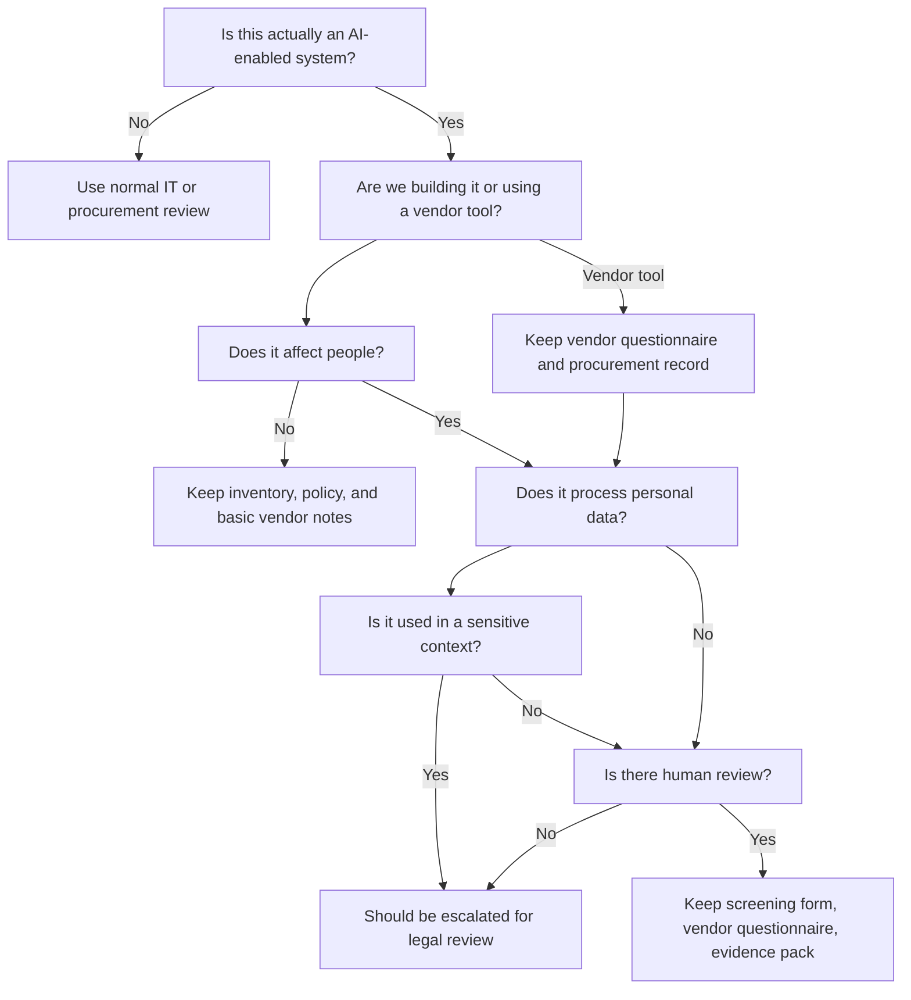

# SME Decision Tree: What Should We Do With This AI Tool?

## Mermaid flowchart

## Plain text fallback

| Step | Question | If yes | If no |
|---|---|---|---|
| 1 | Is this actually an AI-enabled system? | Continue | Use normal IT/procurement review |
| 2 | Are we building it or using a vendor tool? | Record role | Record role |
| 3 | Does it affect people? | Screen more carefully | Keep basic documentation |
| 4 | Does it process personal data? | Add privacy review | Focus on vendor and operational review |
| 5 | Is it used in a sensitive context? | Should be escalated | Continue screening |
| 6 | Is there human review? | Keep evidence | Escalate |
| 7 | What documents should we keep? | Inventory, screening, vendor notes, evidence pack | Basic records |
| 8 | Should we escalate for legal review? | Do not rely on this toolkit alone | Continue with SME controls |

## Practical note

This decision tree is a starting point, not a final legal assessment.
